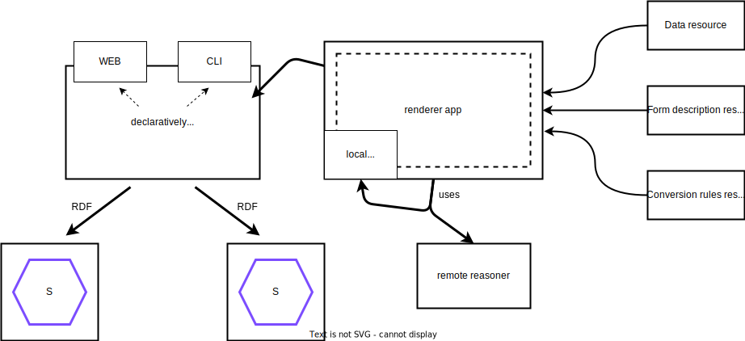

## Architecture
{:#architecture}

<figure id="fig:eaen-currently-to-goal" class="halfwidth">

<figcaption markdown="block">
Transition from the traditional single structure where all the data is defined using a single vocabulary, to a three-part view, consisting of a form (for display), shape (for validation), and footprint (for reasoning) part.
</figcaption>
</figure>

A common way how Web applications store their data is by using one single structure.
As a result, it is not possible to use the data with another application that uses a different structure.
This is even the case for many Solid apps that assume the data is stored in a fixed location in the pod and assuming a specific vocabulary is used.
Therefore, this paper proposes a three-part view on Solid Web forms.
This shift from a single structure to a three-part view is shown schematically in .
On the left, the current situation with the data stored in a single structure and the application built on top of it.
On the right, the goal of this research with the division into three parts: a form (for display), shape (for validation), and footprint (for reasoning) part.
As considerable research has been conducted on RDF data validation   , this part is not covered in this paper.

The architecture can also be viewed from a different angle.
In traditional centralized Web apps, different users interact with the same centralized Web server using different interfaces, all written for and working only with that server.
Additionally, the data is stored on the server of the application, outside the user's control.
The [Solid protocol](cite:cites solid-protocol) provides a standardized interface, tackling that problem, but still many apps are being built with assumptions about the data that is stored in the pod, and they are designed for one specific use case.

<figure id="fig:renderer-architecture">

<figcaption markdown="block">
Users interact with a dynamically generated app built by a form renderer using the 3 inputs displayed on the right.
This generic renderer app can build for multiple viewing environments without making assumptions about the interface and app itself.
It uses a reasoner to apply the schema alignment and footprint tasks.
</figcaption>
</figure>

This paper pushes this decentralized architecture a step further with the introduction of a declarative Solid app that makes no assumptions about the interface and app itself.
A schematic overview of the architecture is shown in .

### Description of the Display Part

<figure id="fig:FormRenderer" class="halfwidth">

<figcaption markdown="block">
Screenshot of the implemented FormRenderer.
</figcaption>
</figure>

The previous problem of needing a separate app for each use case is solved by describing the user interface in a declarative way in the *form description resource*.
This RDF resource contains both the display part and the footprint for the reasoning part.
The display part is the part that is responsible for rendering the form to the user.
There already exist ontologies that can be used for this purpose, such as [SHACL](cite:cites shacl), [Solid-UI](cite:cites solid-ui), and [RDF-Form](cite:cites rdf-form).
Web forms are typically HTML, while RDF represents the semantics of the form, not how you represent it in HTML.
By declaratively describing the form in RDF, we achieve the ability to render the same form description in any environment.
To prove that the display part is unrelated to the viewing environment, two proof-of-concept applications are implemented and discussed in , each rendering the same form description in a different viewing environment.
The first app is the *FormRenderer* which renders the form description in a web browser using HTML.
A screenshot of this app is shown in .
The second app is the *FormCli* which renders the form description in a text-based command-line interface.
The architecture and implementation of these apps are very similar to each other.
The main difference is that the FormCli app does not have a graphical user interface and uses a text-based terminal instead.
The implementation of these apps provides us with proof that the display part is unrelated to the viewing environment as the same form description can be rendered with the two apps.
Another benefit of the semantic and declarative description is that machines can interpret the meaning of the form, allowing forms to be prefilled by machines.
This is achieved with the binding property on each form field, linking to a semantic meaning of that field.
The already existing predicates in the UI ontologies are reused for that, e.g. `ui:property` for Solid-UI, `form:binding` for RDF-Form, and `sh:path` for SHACL.
The binding on the form describes the meaning of the form and will therefore be used as type for the subject of the resulting data after filling out the form.
The bindings on the form fields will be used as predicates on that subject, with as object the values filled in for these fields, as they describe the semantic meaning of these fields.
In the same way that the filled-out form's output is structured, the *data resource* is structured to automatically prefill the form.

### Description of the Schema Alignment Tasks

Unfortunately, the move to decentralization and decoupling comes with its own challenges.
Two main challenges need to be tackled before this can be achieved.
To make the app understand any ontology and achieve a real decoupled solution, *schema alignment tasks* are introduced translating the form description into an ontology the app understands.
The *N3 conversion rules resource* from  is used by the renderer app to perform this mapping.
This resource consists of rules structured using the Notation3 language.
It uses the N3 rules with as premise the part of the form description in the ontology the form description resource is written in.
This can be any ontology that is equivalent to the one the app understands.
The rule conclusion contains the equivalent expression in the ontology the app understands -- Solid-UI in this case.
By passing along this resource to the app, the app does not need to understand the ontology the form description is written in, and any ontology can be used for which a mapping can be provided.
The renderer app needs to apply these rules onto the form description using a reasoner to retrieve the form description in the language it understands.

### Description of the Footprint Tasks

<figure id="fig:FormGenerator" class="halfwidth">

<figcaption markdown="block">
Screenshot of the implemented FormGenerator.
</figcaption>
</figure>

In addition to describing how the form should look, the form description should also declaratively describe what should happen in certain events such as submission.
Therefore, the form description is extended with *policies*.
The process of executing these policies is called the *footprint tasks* and is the second half of the reasoning part of the three-part view.
To describe policies, two languages are needed: a *rule language* and a *policy language* describing what actually should happen when a policy is executed.
As rule language, [N3](cite:cites n3) is used.
This is the same language that is used to describe the conversion rules in the schema alignment tasks and their N3 rules do exactly what is needed.
Policies should describe the client-side operations that need to be performed when a certain event occurs.
This can be much more than just performing an HTTP request to the server.
As the [FnO ontology](cite:cites fno-paper) allows to describe any kind of operation, a basic version of this existing ontology is reused to describe the policy.
 contains two examples of such footprint tasks.
The arguments of these policies, such as the URL to send the HTTP request to or to redirect to, should be defined by the user.
In  you can see a screenshot of the FormGenerator application where the user can provide these values, next to the ability to define form fields.

<figure id="lst:n3-form-policies-example" class="listing">
<pre><code>
@prefix ex:   <http://example.org/> .
@prefix pol: <https://www.example.org/ns/policy#> .
@prefix fno: <https://w3id.org/function/ontology#>.

{
  ?id ex:event ex:Submit.
} => {
  ex:HttpPolicy pol:policy [
    a fno:Execution ;
    fno:executes ex:httpRequest ;
    ex:method "POST" ;
    ex:url <https://httpbin.org/post> ;
    ex:contentType "application/ld+json"
  ] .
} .
{
  ?id ex:event ex:Submit.
} => {
  ex:RedirectPolicy pol:policy [
    a fno:Execution ;
    fno:executes ex:redirect ;
    ex:url <https://smessaert.be>
  ] .
} .
</code></pre>
<figcaption markdown="block">
Example of N3 rules describing different policies to be executed on the form submission event.
</figcaption>
</figure>
