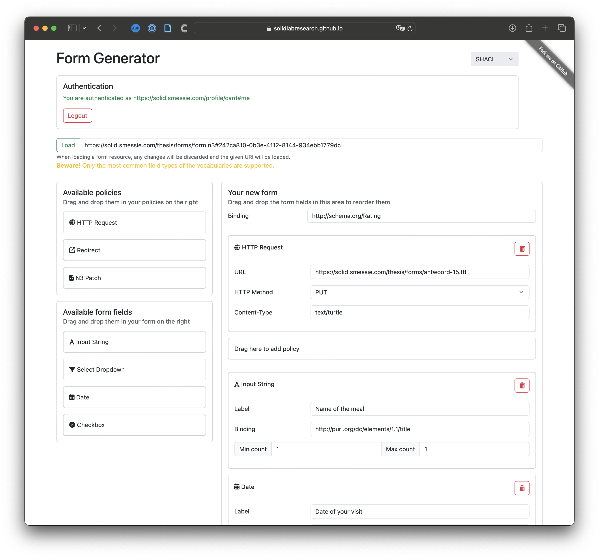

## Implementation
{:#implementation}

We implemented three proof-of-concept apps in TypeScript/JavaScript.
The FormGenerator app is an application programmed in the [Ember framework](cite:cites emberjs) generating a form description based on the form the user builds using drag-and-drop.
The FormRenderer app and FormCli app are two apps that render a given form description in respectively a Web browser using HTML or a text-based command-line interface.

### FormGenerator
{:#implementation-formgenerator}

The first app in the declarative form description pipeline is to generate the declarative form description.[^ImplementationFormGenerator]
In  a screenshot of the implemented app can be seen where the user can provide policy values, next to the ability to define form fields using drag-and-drop.
Not all possible form elements are supported as it only functions as a proof of concept, but additional field types can be added similarly to the existing ones.

[^ImplementationFormGenerator]: The source code of the FormGenerator app can be found at [https://github.com/SolidLabResearch/FormGenerator](https://github.com/SolidLabResearch/FormGenerator).

<figure id="fig:FormGenerator" class="halfwidth">

<figcaption markdown="block">
Implemented FormGenerator app.
</figcaption>
</figure>

As mentioned earlier, describing footprints requires a rules language and a policy language.
As rule language, [Notation3 (N3)](cite:cites n3) is used.
Their N3 rules does exactly what is needed.
The rule premise allows for defining the event, while the rule conclusion defines the policy.
We chose for N3 as they proved to be a working solution for our use case and the reasoning engine EYE implementing N3 is being developed at our lab.
We therefore also made the decision to use the [EYE-JS library](cite:cites eye-js), a browser and node-distributed EYE reasoner via WebAssembly.
By the use of reasoning, we obtain the rule conclusion which is then being parsed using a SPARQL query.
Querying is done using [Comunica](cite:cites taelman_iswc_resources_comunica_2018), a knowledge graph querying framework.

The policy we obtain is defined using a policy language.
There are already existing ontologies that can be reused to describe policies, even though they were not designed for this purpose.
[Hydra](cite:cites hydra) is a vocabulary to describe Web APIs in Linked Data and its intended use is to describe the server side of the API in a machine-readable way.
A major limitation for our research is that it can only describe HTTP requests, while policies go beyond that.
Therefore, we chose to not use Hydra.

The Function Ontology (FnO)   is used to semantically define and describe implementation-independent functions, including their relations to related concepts such as parameters, and mappings to specific implementations and executions.
As FnO allows to describe any kind of operation unlike e.g. Hydra which only allows for describing HTTP requests, a basic version of this existing ontology is reused to describe the policy.
 contains an example of a footprint task sending an HTTP request.
The arguments of these policies, such as the URL to send the HTTP request to or to redirect to, should be defined by the user.

<figure id="lst:n3-form-policies-example" class="listing">
<pre><code>
@prefix ex:   <http://example.org/> .
@prefix pol: <https://www.example.org/ns/policy#> .
@prefix fno: <https://w3id.org/function/ontology#>.

{
  ?id ex:event ex:Submit.
} => {
  ex:HttpPolicy pol:policy [
    a fno:Execution ;
    fno:executes ex:httpRequest ;
    ex:method "POST" ;
    ex:url <https://httpbin.org/post> ;
    ex:contentType "application/ld+json"
  ] .
} .
</code></pre>
Replace `ex:` with existing vocabulary
<figcaption markdown="block">
Example of N3 rule describing HTTP request policy to be executed on the form submission event.
</figcaption>
</figure>

When constructing the form, users must specify bindings for each field, which are URIs semantically describing the fields.
Users must manually enter these bindings. To simplify this process, they can utilize prefixes, which are automatically expanded to full URIs via the [prefix.cc](https://prefix.cc) API.
As an example, `ex:MyField` will become `http://example.org/MyField`.
I'm pretty sure there is some related work around guessing proper predicates for human-written labels. It would be good to look for those, and cite them if applicable in any way.

### FormRenderer and FormCli

<figure id="fig:FormRenderer" class="halfwidth">

<figcaption markdown="block">
Implemented FormRenderer app.
</figcaption>
</figure>

The next application in the pipeline is to render the declarative form description and let the user fill out that form.
We implemented two versions in two different viewing environments to prove that the display part of the form description is independent of the viewing environment.[^ImplementationFormRenderer] [^ImplementationFormCli]
The FormRenderer app is created in the [Vue.js framework](cite:cites vue) and functions in the Web browser.
A screenshot of this app is shown in .
The FormCli app operates as a command-line application, allowing usage without a GUI.
The form questions are prompted to the user one after each other.
While the FormRenderer app supports authenticating with a Solid identity provider, authentication is not implemented in the FormCli app as the Solid protocol lacks proper authentication for command-line applications.
We therefore consider this outside the scope of this research.

[^ImplementationFormRenderer]: The source code of the FormRenderer app can be found at [https://github.com/<wbr/>SolidLabResearch/FormRenderer](https://github.com/SolidLabResearch/FormRenderer).
[^ImplementationFormCli]: The source code of the FormCli app can be found at [https://github.com/<wbr/>SolidLabResearch/FormCli](https://github.com/SolidLabResearch/FormCli).

Solid-UI is chosen as display ontology that the app understands as this is an ontology that is especially made for the purpose of defining user interfaces.
Schema alignment tasks are performed by applying the conversion rules over the form description.
N3 rules are used again to implement this together with the EYE-JS reasoner to apply them.
The output of this reasoning step is the equivalent form description in the Solid-UI vocabulary, which is then parsed by the Comunica engine using SPARQL queries.

#### Determining the Subject for the Produced RDF

When dealing with a resource containing pre-existing data for form filling, it's straightforward to determine the subject URI for writing new data — it can be reused from the existing data.
Furthermore, when no resource is provided or when multiple subjects within the resource conform to the form's structure and target class, determining the subject URI becomes ambiguous.
Various solutions were explored to address this problem.

1. Generating a new random UUID and using it as the subject URI with the `urn:uuid:` namespace .

2. Prompting the user to enter a subject URI.

3. Utilizing the URI from the HTTP Request policy as the subject URI.

4. Selecting one of the existing subjects as the subject URI.

5. Employing a blank node in place of a subject URI.

6. Specifying the subject URI in the form description.

Blank nodes are often an unsuitable solution since they lack a URI, making it impossible to reference the data using a valid URI or to link to from other resources.
Using the URI to which the data is posted is also not a good solution, as this URI is not necessarily meaningful or even a unique URI.
Not all ontologies for describing forms do have a property to define the subject URI, eliminating option 6.
This leaves us with options 1, 2, and 4 as the viable choices.
Using a random UUID is a feasible solution, ensuring uniqueness, and serving as an ideal default subject URI.
Prompting the user allows the user to enter a meaningful subject URI himself, which is also feasible.
Focusing solely on this option requires users to understand subject URIs, potentially complicating app use for those new to the Semantic Web. Our goal is to ensure ease of use for all.
Using an existing subject is a good option, especially when there's a single subject, aligning with user expectations for data editing.
With multiple subjects, selection becomes a challenge for users unfamiliar with the concept.
We propose and implement a combination of the three last feasible options.
Use a random UUID as the default subject URI, while enabling user selection from existing subjects or manual subject URI entry.
Parsing the policies is done in the same way as in the FormGenerator app, described earlier in .
